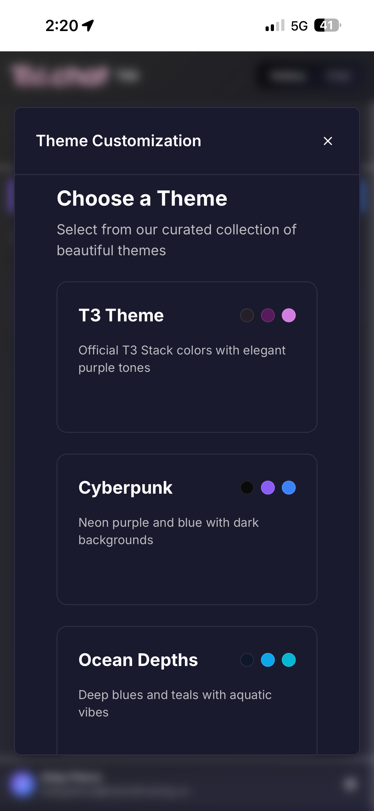

# T66 - Open Source AI Chat Application

[](https://opensource.org/licenses/MIT)
[](https://reactjs.org/)
[](https://firebase.google.com/)
[](https://www.typescriptlang.org/)
[](https://vitejs.dev/)

> 🚀 **A powerful, open-source AI chat platform** - Built for the T3 Chat Cloneathon with cutting-edge features and beautiful design.

## 📱 Previews

<div align="center">

<!-- Hero Video Section -->
<div style="background: linear-gradient(135deg, #667eea 0%, #764ba2 100%); padding: 40px; border-radius: 20px; margin: 20px 0; box-shadow: 0 20px 40px rgba(0,0,0,0.1);">
  <h3 style="color: white; margin: 0 0 20px 0; font-size: 28px;">🎬 Experience T66 in Action</h3>
  <div style="position: relative; display: inline-block; border-radius: 15px; overflow: hidden; box-shadow: 0 15px 35px rgba(0,0,0,0.3);">
    <a href="https://youtu.be/UoTBjFbPuik">
      
    </a>
  </div>
  <p style="color: rgba(255,255,255,0.9); margin: 20px 0 0 0; font-size: 16px;">✨ Click to watch the full demo showcasing T66's cutting-edge features</p>
</div>

<!-- Screenshots Gallery -->
<div style="background: linear-gradient(135deg, #f8f9ff 0%, #e8f0ff 100%); padding: 40px 20px; border-radius: 20px; margin: 40px 0;">
  <h3 style="color: #667eea; font-size: 28px; text-align: center; margin-bottom: 30px;">📸 Application Screenshots</h3>
  
  <table style="width: 100%; border-collapse: collapse;">
    <tr>
      <td align="center" style="padding: 20px; vertical-align: top;">
        <div style="background: white; border-radius: 15px; padding: 15px; box-shadow: 0 8px 20px rgba(0,0,0,0.1);">
          <h4 style="color: #667eea; margin: 0 0 15px 0;">💬 Chat Interface</h4>
          <div style="height: 400px; display: flex; align-items: center; justify-content: center; overflow: hidden; border-radius: 10px;">
            
          </div>
          <p style="margin: 15px 0 0 0; color: #666; font-size: 14px; line-height: 1.5;">Modern AI chat with multiple models, syntax highlighting, and real-time streaming responses</p>
        </div>
      </td>
      <td align="center" style="padding: 20px; vertical-align: top;">
        <div style="background: white; border-radius: 15px; padding: 15px; box-shadow: 0 8px 20px rgba(0,0,0,0.1);">
          <h4 style="color: #764ba2; margin: 0 0 15px 0;">📚 Chat History</h4>
          <div style="height: 400px; display: flex; align-items: center; justify-content: center; overflow: hidden; border-radius: 10px;">
            
          </div>
          <p style="margin: 15px 0 0 0; color: #666; font-size: 14px; line-height: 1.5;">Organized conversation management with folders, search, and intelligent categorization</p>
        </div>
      </td>
    </tr>
    <tr>
      <td align="center" style="padding: 20px; vertical-align: top;">
        <div style="background: white; border-radius: 15px; padding: 15px; box-shadow: 0 8px 20px rgba(0,0,0,0.1);">
          <h4 style="color: #f093fb; margin: 0 0 15px 0;">📱 Mobile Experience</h4>
          <div style="height: 400px; display: flex; align-items: center; justify-content: center; overflow: hidden; border-radius: 10px;">
            
          </div>
          <p style="margin: 15px 0 0 0; color: #666; font-size: 14px; line-height: 1.5;">Responsive PWA design optimized for mobile with touch-friendly interface</p>
        </div>
      </td>
      <td align="center" style="padding: 20px; vertical-align: top;">
        <div style="background: white; border-radius: 15px; padding: 15px; box-shadow: 0 8px 20px rgba(0,0,0,0.1);">
          <h4 style="color: #9b59b6; margin: 0 0 15px 0;">📱 Mobile Features</h4>
          <div style="height: 400px; display: flex; align-items: center; justify-content: center; overflow: hidden; border-radius: 10px;">
            
          </div>
          <p style="margin: 15px 0 0 0; color: #666; font-size: 14px; line-height: 1.5;">Advanced mobile functionality with intuitive gesture controls and optimized performance</p>
        </div>
      </td>
    </tr>
    <tr>
      <td align="center" colspan="2" style="padding: 20px; vertical-align: top;">
        <div style="background: white; border-radius: 15px; padding: 15px; box-shadow: 0 8px 20px rgba(0,0,0,0.1); max-width: 800px; margin: 0 auto;">
          <h4 style="color: #fcb69f; margin: 0 0 15px 0;">🎨 App Branding</h4>
          <div style="background: linear-gradient(45deg, #ffecd2, #fcb69f); padding: 30px; border-radius: 10px; margin-bottom: 15px;">
            
          </div>
          <p style="margin: 0; color: #666; font-size: 14px; line-height: 1.5;">Beautiful T66 branding with PWA support for home screen installation</p>
        </div>
      </td>
    </tr>
  </table>
</div>

<!-- AI Providers Section -->
<div style="background: linear-gradient(135deg, #f5f7fa 0%, #c3cfe2 100%); padding: 50px 30px; border-radius: 25px; margin: 60px 0;">
  <h3 style="font-size: 28px; margin-bottom: 30px; color: #2c3e50;">🎯 Powered by Leading AI Providers</h3>
  <div style="display: flex; flex-wrap: wrap; justify-content: center; gap: 25px; margin: 40px 0;">
    <div style="background: white; padding: 20px; border-radius: 15px; box-shadow: 0 8px 25px rgba(0,0,0,0.1); transition: transform 0.3s ease;" onmouseover="this.style.transform='scale(1.1)'" onmouseout="this.style.transform='scale(1)'">
      
    </div>
    <div style="background: white; padding: 20px; border-radius: 15px; box-shadow: 0 8px 25px rgba(0,0,0,0.1); transition: transform 0.3s ease;" onmouseover="this.style.transform='scale(1.1)'" onmouseout="this.style.transform='scale(1)'">
      
    </div>
    <div style="background: white; padding: 20px; border-radius: 15px; box-shadow: 0 8px 25px rgba(0,0,0,0.1); transition: transform 0.3s ease;" onmouseover="this.style.transform='scale(1.1)'" onmouseout="this.style.transform='scale(1)'">
      
    </div>
    <div style="background: white; padding: 20px; border-radius: 15px; box-shadow: 0 8px 25px rgba(0,0,0,0.1); transition: transform 0.3s ease;" onmouseover="this.style.transform='scale(1.1)'" onmouseout="this.style.transform='scale(1)'">
      
    </div>
    <div style="background: white; padding: 20px; border-radius: 15px; box-shadow: 0 8px 25px rgba(0,0,0,0.1); transition: transform 0.3s ease;" onmouseover="this.style.transform='scale(1.1)'" onmouseout="this.style.transform='scale(1)'">
      
    </div>
    <div style="background: white; padding: 20px; border-radius: 15px; box-shadow: 0 8px 25px rgba(0,0,0,0.1); transition: transform 0.3s ease;" onmouseover="this.style.transform='scale(1.1)'" onmouseout="this.style.transform='scale(1)'">
      
    </div>
    <div style="background: white; padding: 20px; border-radius: 15px; box-shadow: 0 8px 25px rgba(0,0,0,0.1); transition: transform 0.3s ease;" onmouseover="this.style.transform='scale(1.1)'" onmouseout="this.style.transform='scale(1)'">
      
    </div>
  </div>
  <div style="background: rgba(255,255,255,0.8); padding: 20px; border-radius: 15px; margin-top: 30px;">
    <p style="margin: 0; color: #34495e; font-size: 18px; font-weight: 500;">🌟 Access to <strong>50+ AI models</strong> through seamless OpenRouter integration</p>
  </div>
</div>

## 💡 Our Vision

<div align="center">

**We really wanted to build something that we would genuinely want to use, so that is what we built with T66 Chat.**

### 🚀 Future Features

> There are several features we didn't get to build, such as an **advanced mode** that would allow you to create functions, update system prompts, adjust temperature, and access more advanced settings. We also want to add simple features that aren't in T3, such as **memory** (which was almost completed before the Cloneathon deadline but was too buggy to release).

### ✨ Our Commitment

**We plan on continuing this project after the Cloneathon ends to create the AI chat experience we truly want to use every day.**

---

</div>

<!-- Team Section -->
<div style="background: linear-gradient(135deg, #667eea 0%, #764ba2 100%); padding: 40px 20px; border-radius: 20px; margin: 40px 0;">
  <h3 style="color: white; font-size: 28px; text-align: center; margin-bottom: 30px;">👥 Meet the Team</h3>
  
  <table style="width: 100%; max-width: 700px; margin: 0 auto; border-collapse: collapse;">
    <tr>
      <td align="center" style="padding: 20px;">
        <div style="background: rgba(255,255,255,0.95); padding: 30px; border-radius: 15px; text-align: center; box-shadow: 0 10px 25px rgba(0,0,0,0.2);">
          
          <h4 style="margin: 0 0 10px 0; color: #2c3e50; font-size: 20px;">👨‍💻 Koby Pierce</h4>
          <p style="margin: 0; color: #7f8c8d; font-style: italic;">Co-Founder & Developer</p>
        </div>
      </td>
      <td align="center" style="padding: 20px;">
        <div style="background: rgba(255,255,255,0.95); padding: 30px; border-radius: 15px; text-align: center; box-shadow: 0 10px 25px rgba(0,0,0,0.2);">
          
          <h4 style="margin: 0 0 10px 0; color: #2c3e50; font-size: 20px;">🚀 Aiden Hamade</h4>
          <p style="margin: 0; color: #7f8c8d; font-style: italic;">Co-Founder & Developer</p>
        </div>
      </td>
    </tr>
  </table>
  
  <div style="background: rgba(255,255,255,0.15); padding: 25px; border-radius: 15px; margin-top: 30px; text-align: center; max-width: 600px; margin-left: auto; margin-right: auto;">
    <p style="margin: 0; color: white; font-size: 18px; font-weight: bold;">🏆 Built for the T3 Chat Cloneathon Competition</p>
    <p style="margin: 10px 0 0 0; color: rgba(255,255,255,0.9); font-size: 15px;">Pushing the boundaries of AI chat experiences</p>
  </div>
</div>

</div>

## 🔥 Overview

**T66** is a modern, feature-rich AI chat application that brings together multiple language models in an intuitive interface. Built with React 19, TypeScript, and Firebase, it offers a seamless experience for chatting with various AI providers including OpenAI, Anthropic, Google, and more through OpenRouter.

## ✨ Features

### 🤖 AI & Chat Features
- **Multiple AI Providers** - Support for OpenAI, Anthropic, Google, Cohere, and 50+ models via OpenRouter
- **Chat Management** - Create, organize, and manage conversations with folders
- **Real-time Streaming** - Live message streaming with typing indicators
- **Message Editing** - Edit and regenerate messages with different models
- **Chat Branching** - Split conversations to explore different paths
- **Token Counting** - Real-time usage tracking and cost estimation

### 🎨 UI/UX Features
- **Beautiful Interface** - Modern, responsive design with smooth animations
- **Theme System** - Fully customizable color schemes with preset themes
- **Landing Page** - Interactive theme preview and customization
- **Mobile Responsive** - Works seamlessly on desktop and mobile devices
- **Syntax Highlighting** - Code blocks with language detection and formatting
- **Markdown Support** - Rich text rendering with GitHub-flavored markdown

### 🚀 Advanced Features
- **Voice Mode** - Speech-to-text input and text-to-speech output
- **File Attachments** - Upload and chat about images, PDFs, and documents
- **Web Search** - Real-time web search integration with source citations
- **Chat Sharing** - Share conversations with public links
- **Cross-device Sync** - Conversations sync across all your devices

## 🏗️ Architecture

### Tech Stack
- **Frontend**: React 19 with TypeScript and Vite
- **Backend**: Firebase (Auth, Firestore, Realtime Database)
- **Styling**: Tailwind CSS with custom theme system
- **State Management**: Zustand for global state
- **Routing**: React Router DOM v7
- **AI Integration**: OpenRouter API for multiple providers
- **Voice**: OpenAI Whisper for speech-to-text, TTS for speech synthesis

### Project Structure

```
t66-clone/
├── 📁 frontend/                    # Main React application
│   ├── 📁 src/
│   │   ├── 📁 components/
│   │   │   ├── 📁 auth/            # Authentication components
│   │   │   │   ├── LoginPage.tsx
│   │   │   │   └── ProtectedRoute.tsx
│   │   │   ├── 📁 chat/            # Chat-specific components
│   │   │   │   └── SharedChatView.tsx
│   │   │   ├── 📁 settings/        # Settings and configuration
│   │   │   │   ├── ModelSelectorModal.tsx
│   │   │   │   ├── SettingsModal.tsx
│   │   │   │   ├── ThemeModal.tsx
│   │   │   │   └── ThemePresetCard.tsx
│   │   │   └── 📁 ui/              # Reusable UI components
│   │   │       ├── Button.tsx
│   │   │       ├── Dropdown.tsx
│   │   │       ├── EditMessageModal.tsx
│   │   │       ├── HtmlPreviewModal.tsx
│   │   │       ├── MarkdownRenderer.tsx
│   │   │       ├── Modal.tsx
│   │   │       ├── ShareModal.tsx
│   │   │       ├── ThinkingIndicator.tsx
│   │   │       └── VoiceModeButton.tsx
│   │   ├── 📁 lib/                 # Utility libraries
│   │   │   ├── audioRecording.ts   # Voice recording utilities
│   │   │   ├── auth.ts             # Authentication helpers
│   │   │   ├── firebase.ts         # Firebase configuration
│   │   │   ├── firestore.ts        # Firestore utilities
│   │   │   ├── openai.ts           # OpenAI integration
│   │   │   ├── openrouter.ts       # OpenRouter API client
│   │   │   ├── realtime.ts         # Real-time features
│   │   │   ├── themeStorage.ts     # Theme persistence
│   │   │   └── utils.ts            # General utilities
│   │   ├── 📁 stores/              # Zustand state stores
│   │   │   ├── authStore.ts        # Authentication state
│   │   │   ├── chatStore.ts        # Chat and message state
│   │   │   └── themeStore.ts       # Theme state
│   │   ├── 📁 types/               # TypeScript definitions
│   │   │   ├── index.ts            # Main types
│   │   │   └── theme.ts            # Theme types
│   │   ├── 📁 config/              # Configuration files
│   │   │   └── themePresets.ts     # Theme presets
│   │   └── 📁 assets/              # Static assets
│   │       ├── react.svg
│   │       ├── system_prompt.txt
│   │       └── t66-chat-logo.svg
│   ├── 📄 package.json
│   ├── 📄 vite.config.ts
│   ├── 📄 tailwind.config.js
│   └── 📄 tsconfig.json
│
├── 📁 landing-page/                # Interactive landing page
│   ├── 📁 src/
│   │   ├── 📄 App.tsx              # Theme customization demo
│   │   └── 📁 assets/
│   │       ├── 2024-P13259.jpg
│   │       ├── koby_pfp.png
│   │       └── t66-chat-logo.svg
│   ├── 📄 package.json
│   └── 📄 vite.config.ts
│
├── 📁 scripts/                     # Development scripts
│   └── 📄 README.md                # Scripts documentation
│
├── 📄 env.example                  # Environment variables template
├── 📄 .gitignore
├── 📄 LICENSE                      # MIT License
└── 📄 README.md                    # This file
```

## 🚀 Quick Start

### Prerequisites
- Node.js 18+ and npm/yarn
- Firebase project (for authentication and data storage)
- OpenRouter API key (for AI models)

### 1. Clone the Repository
```bash
git clone https://github.com/aiden-hamade/t66-clone.git
cd t66-clone
```

### 2. Set Up Environment Variables
```bash
cp env.example .env
```

Edit `.env` with your Firebase configuration:
```env
# Firebase Configuration
VITE_FIREBASE_API_KEY=your-firebase-api-key
VITE_FIREBASE_AUTH_DOMAIN=your-project.firebaseapp.com
VITE_FIREBASE_PROJECT_ID=your-project-id
VITE_FIREBASE_STORAGE_BUCKET=your-project.appspot.com
VITE_FIREBASE_MESSAGING_SENDER_ID=123456789
VITE_FIREBASE_APP_ID=1:123456789:web:abcdef123456
```

### 3. Install Dependencies & Start Frontend
```bash
cd frontend
npm install
npm run dev
```

### 4. Set Up Your Account
1. Open http://localhost:5173 in your browser
2. Create an account or sign in
3. Go to Settings (gear icon) and add your API keys:
   - **OpenRouter API Key**: For general AI model access
   - **OpenAI API Key**: For voice features (optional)

### 5. Start Chatting!
- Select a model from the dropdown
- Type a message or use voice input
- Explore different themes and settings
- Create folders to organize your chats

## 🔧 Configuration

### Firebase Setup
1. Create a new Firebase project at https://console.firebase.google.com/
2. Enable Authentication with Email/Password
3. Set up Firestore Database
4. Copy your config to `.env`

### API Keys
- **OpenRouter**: Sign up at https://openrouter.ai/ for access to 50+ AI models
- **OpenAI**: Get your API key at https://platform.openai.com/ (for voice features)

Users can add their own API keys through the Settings modal - no server-side configuration needed!

## 🎨 Themes

T66 includes a powerful theming system with:
- **6 Built-in Presets**: Cyberpunk, Ocean Depths, Sunset Vibes, Forest Green, Royal Purple, Monochrome
- **Custom Themes**: Create your own with the interactive theme editor
- **Live Preview**: See changes in real-time on the landing page
- **Gradient Support**: Use solid colors or gradients for any element

## 📱 Mobile Support

### Mobile Preview


T66 is fully responsive and works great on mobile devices:
- Touch-friendly interface
- Swipe gestures for navigation
- Mobile-optimized voice input
- Progressive Web App (PWA) capabilities

## 🔊 Voice Features

### Speech-to-Text
- Use the microphone button to speak your messages
- Powered by OpenAI Whisper for accurate transcription
- Works in any supported language

### Text-to-Speech
- Automatic response playback in voice mode
- Natural-sounding voice synthesis
- Configurable in settings

## 📊 Usage Tracking

- Real-time token counting for cost estimation
- Usage statistics per conversation
- Support for multiple AI provider pricing

## 🛠️ Development

### Available Scripts

#### Frontend
```bash
npm run dev      # Start development server
npm run build    # Build for production
npm run preview  # Preview production build
npm run lint     # Run ESLint
```

#### Landing Page
```bash
npm run dev      # Start development server
npm run build    # Build for production
```

### Building for Production
```bash
cd frontend
npm run build
```

The build artifacts will be in `frontend/dist/`.

## Future Development

We are working on a Progressive Web App (PWA). A buggy version can be found on branch 'pwa'.

## 🤝 Contributing

We welcome contributions! Here's how to get started:

### Development Workflow
1. Fork the repository
2. Create a feature branch: `git checkout -b feature/amazing-feature`
3. Make your changes
4. Test thoroughly
5. Commit your changes: `git commit -m 'Add amazing feature'`
6. Push to the branch: `git push origin feature/amazing-feature`
7. Submit a pull request

## 🔒 Security

- Firebase Authentication for secure user management
- API keys stored securely on client-side
- No sensitive data transmitted to servers
- Regular security updates

## 📈 Performance

- Optimized React components with proper memoization
- Efficient state management with Zustand
- Lazy loading for better initial page load
- Theme preferences cached locally

## 🌍 Browser Support

- Chrome/Chromium 90+
- Firefox 88+
- Safari 14+
- Edge 90+

## 📄 License

This project is licensed under the MIT License - see the [LICENSE](LICENSE) file for details.

## 🙏 Acknowledgments

- **React Team** - For the amazing React ecosystem
- **Firebase Team** - For excellent backend services
- **OpenRouter** - For providing access to multiple AI models
- **Tailwind CSS** - For the utility-first CSS framework
- **Cloudflare** - For hosting and deployment
- **Open Source Community** - For all the incredible libraries and tools

## 🔗 Links

- **GitHub Repository**: [https://github.com/aiden-hamade/t66-clone](https://github.com/aiden-hamade/t66-clone)

## 📞 Support

- 🐛 [Report Issues](https://github.com/aiden-hamade/t66-clone/issues)
- 💬 [Discussions](https://github.com/aiden-hamade/t66-clone/discussions)

---

**Built with ❤️ for the T3 Chat Cloneathon**

> "The future of AI chat is open source" - T66 Team

### 🎯 Competition Highlights

**T66** was built specifically for the T3 Chat Cloneathon with these standout features:

✅ **All Core Requirements Met**
- Multi-model AI chat support
- User authentication & sync
- Browser-friendly with PWA
- Easy deployment & setup
- Stunning, responsive UI

🌟 **Bonus Features Implemented**
- Voice mode with speech-to-text
- File attachments support
- Real-time web search
- Chat sharing & branching
- Advanced theming system
- Mobile optimization

This project demonstrates modern web development practices, clean architecture, and a focus on user experience that makes AI chat accessible to everyone.
